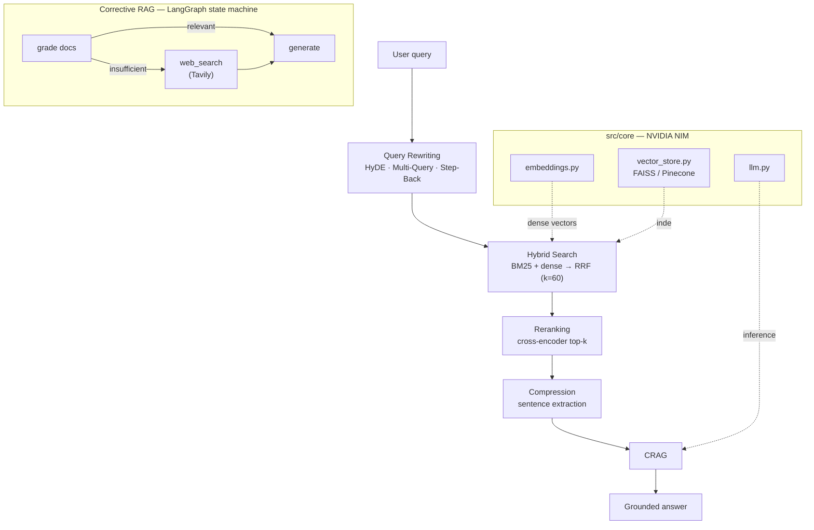

# NVIDIA NIM RAG Techniques

[](https://github.com/shaikn6/nvidia-nim-rag-techniques/actions)
[](https://python.org)
[](LICENSE)
[](https://github.com/astral-sh/ruff)
[](#tests)


**Five production-grade RAG optimization techniques, powered by [NVIDIA NIM](https://www.nvidia.com/en-us/ai/) and orchestrated with LangChain / LangGraph.**

Naive RAG — embed, retrieve top-k, stuff into the prompt — falls over on real corpora: keyword-heavy queries miss, embeddings surface near-duplicates, long contexts bury the answer, and the model has no recourse when retrieval is simply wrong. This repo implements the five techniques that fix each failure mode, each isolated, tested, and benchmarkable against a naive baseline.

---

## The Five Techniques

| # | Technique | Problem it solves | Module |
|---|-----------|-------------------|--------|
| 1 | **Hybrid Search + RRF** | Dense embeddings miss exact terms (tickers, IDs, code) | `src/techniques/hybrid_search.py` |
| 2 | **Cross-Encoder Reranking** | Top-k by cosine returns near-duplicates, not the best answer | `src/techniques/reranking.py` |
| 3 | **Query Rewriting** (HyDE · Multi-Query · Step-Back) | Short/ambiguous queries retrieve poorly | `src/techniques/query_rewriting.py` |
| 4 | **Context Compression** | Long contexts bury the signal and waste tokens | `src/techniques/compression.py` |
| 5 | **Corrective RAG (CRAG)** | Retrieval is sometimes wrong with no fallback | `src/techniques/corrective_rag.py` |

- **Hybrid Search** fuses BM25 (lexical) and dense vector scores via Reciprocal Rank Fusion.
- **Reranking** scores each candidate against the query with a cross-encoder, then keeps the true top-k.
- **Query Rewriting** generates a hypothetical answer (HyDE), multiple query variants, and a step-back abstraction.
- **Compression** extracts only the query-relevant sentences before they reach the LLM.
- **Corrective RAG** grades retrieved docs with a LangGraph state machine and falls back to web search (Tavily) when they're insufficient.

---

## Architecture

The five techniques compose into a single retrieve → refine → ground flow. Each
stage is independently testable and can be benchmarked in isolation against the
naive baseline.



- **`src/core/`** — NVIDIA NIM LLM client (`llm.py`), embeddings (`embeddings.py`), FAISS/Pinecone vector store (`vector_store.py`)
- **`src/techniques/`** — the five techniques, each behind a common interface
- **`src/pipeline/`** — composable pipeline (`base.py`) and a benchmark harness (`benchmark.py`) that scores each technique against the naive baseline

### How it works

- **Reciprocal Rank Fusion.** Hybrid search merges the BM25 and dense rank lists
  with `RRF(d) = Σ 1 / (k + rank_i(d))`, `k=60` — rank-based fusion that needs no
  score normalization between the two retrievers (`reciprocal_rank_fusion` in
  `hybrid_search.py`).
- **Corrective RAG as a graph.** `build_crag_graph` wires a LangGraph
  `StateGraph`: `retrieve → grade → {generate | web_search → generate} → END`.
  A conditional edge routes to the Tavily web-search fallback only when graded
  documents are insufficient, so the model is never forced to answer from bad
  context.
- **Benchmark methodology.** `run_benchmark` runs each pipeline over a shared
  query set, capturing per-run latency (`time.perf_counter`) and exceptions;
  `BenchmarkReport.summary()` aggregates `avg_latency_ms`, `error_rate`, and
  `query_count` per technique so any optimization is measured against the naive
  baseline rather than asserted. Absolute numbers depend on your NIM endpoint,
  corpus, and query set — run it on yours.

---

## Quickstart

```bash
git clone https://github.com/shaikn6/nvidia-nim-rag-techniques
cd nvidia-nim-rag-techniques

python -m venv .venv && source .venv/bin/activate
pip install -e ".[dev]"

cp .env.example .env   # add your NVIDIA_NIM_API_KEY
```

```bash
# Run the test suite (95%+ coverage gate)
pytest --cov

# Benchmark all five techniques vs. naive RAG
python -m src.pipeline.benchmark
```

## Configuration

| Variable | Required | Purpose |
|----------|----------|---------|
| `NVIDIA_NIM_API_KEY` | ✅ | NVIDIA NIM inference + embeddings |
| `NVIDIA_NIM_BASE_URL` | ✅ | NIM endpoint (default `integrate.api.nvidia.com/v1`) |
| `PINECONE_API_KEY` / `PINECONE_INDEX` | optional | Pinecone vector store (FAISS is default) |
| `TAVILY_API_KEY` | optional | Web-search fallback for Corrective RAG |

---

## Tech Stack

LangChain · LangGraph · NVIDIA NIM · FAISS · BM25 (rank-bm25) · sentence-transformers · Pydantic · pytest

## Tests

Every technique has an isolated test module under `tests/`, plus a benchmark test. CI runs lint (ruff) and the full suite with a 95% coverage gate.

## License

MIT
